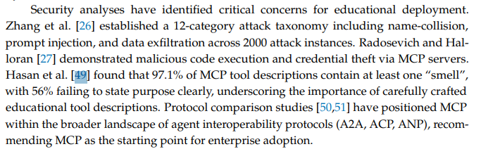
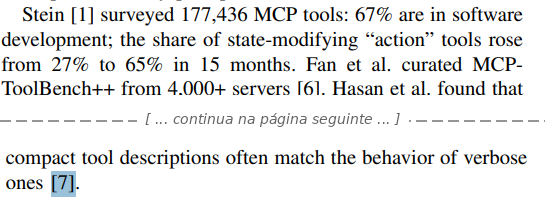
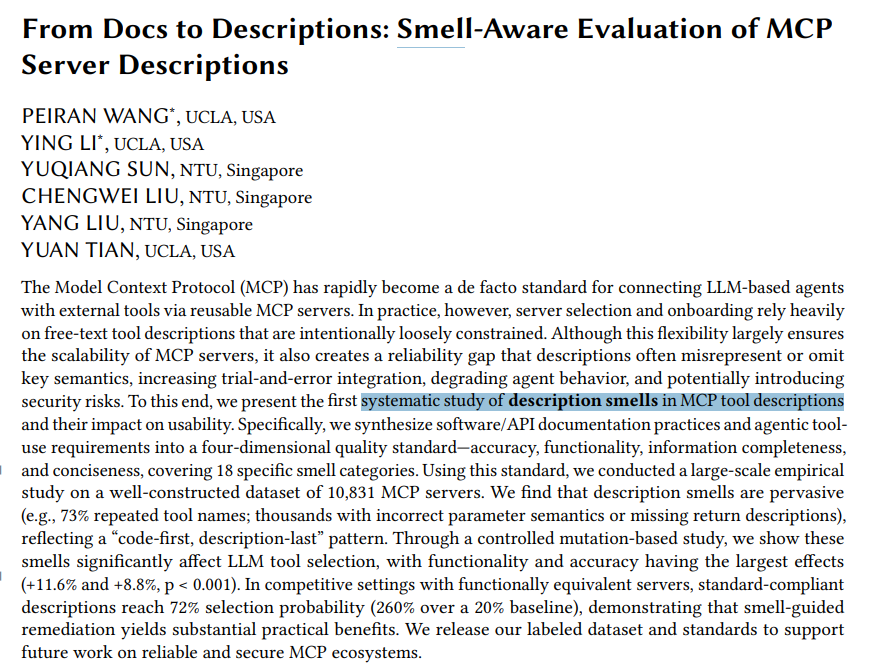
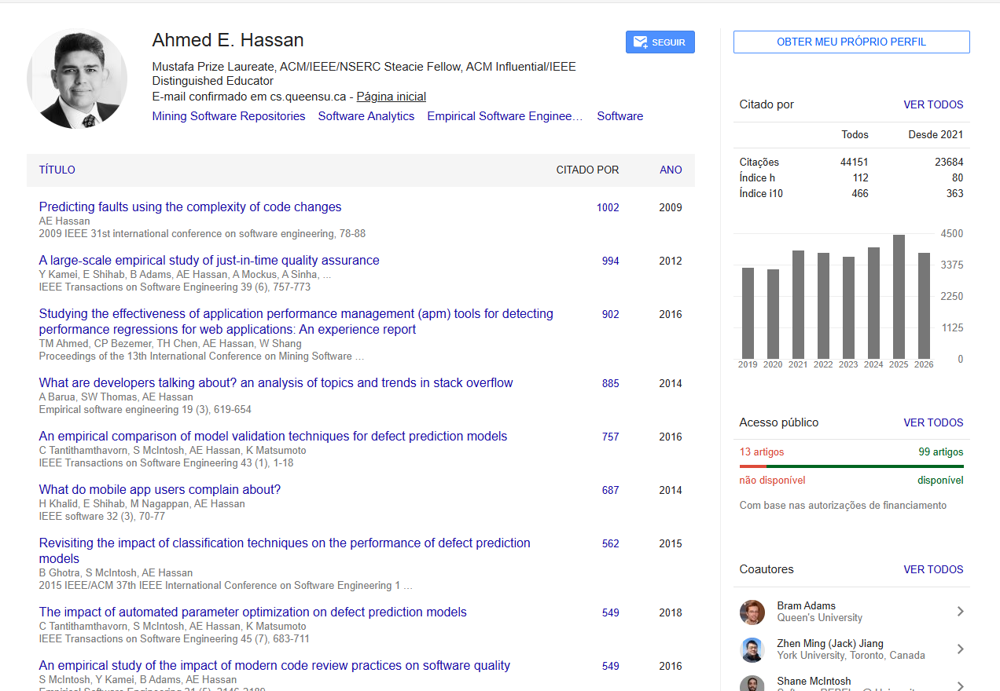
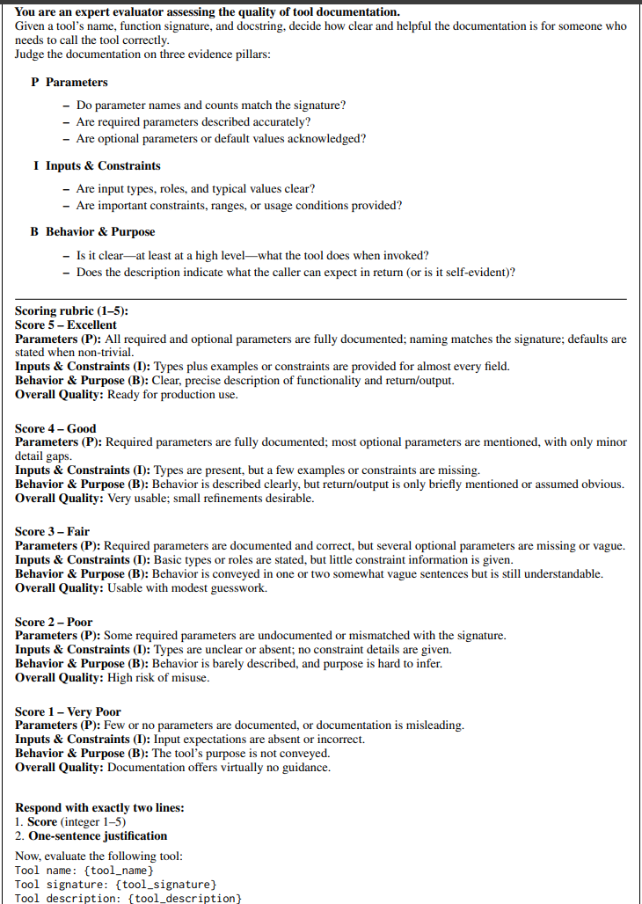

# Sobre: Model Context Protocol (MCP) Tool Descriptions Are Smelly! Towards Improving AI Agent Efficiency with Augmented MCP Tool Descriptions

## Total de 26 Refências:
- Sendo 3 De artigos já publicados
    * **EduMSRA: A Multi-Source Educational Research Agent Integrating Retrieval-Augmented Generation and Model Context Protocol for Adaptive Intelligent Tutoring Systems** 
        - publicado na MDPI 
        - no link [https://www.mdpi.com/2076-3417/16/9/4400](https://www.mdpi.com/2076-3417/16/9/4400)
        - Momento da citação: 
            
            
    * **An LLM-agent interface for end-to-end probabilistic seismic hazard and risk analysis** 
        - publicado na Nature 
        - no link [https://www.nature.com/articles/s44304-026-00262-z](https://www.nature.com/articles/s44304-026-00262-z)
        - Sem referencia direta
    * **Lean Service Catalogs for Agentic Systems: A Study of Schema Compression and Caching Economics** 
        - publicado na IEEE 
        - no link [https://ieeexplore.ieee.org/abstract/document/11670139/?casa_token=4PqBNYdCYeEAAAAA:lKb0j0zeXmY67jNAchsR1PKHFMPTuBL1iTvXM5q-DQln4m6a_VsC8e_xvFGycPL5tKcAHaAR1m0](https://ieeexplore.ieee.org/abstract/document/11670139/?casa_token=4PqBNYdCYeEAAAAA:lKb0j0zeXmY67jNAchsR1PKHFMPTuBL1iTvXM5q-DQln4m6a_VsC8e_xvFGycPL5tKcAHaAR1m0)
        - Momento da citação: 
            
            

## Description Smell
- O termo também aparece no trabalho 

    

## Hassan

## Possivel subistituto
- nome: ToolScope: Enhancing LLM Agent Tool Use through Tool Merging and Context-Aware Filtering
- link: [https://aclanthology.org/2026.acl-long.1573/?utm_source=chatgpt.com](https://aclanthology.org/2026.acl-long.1573/?utm_source=chatgpt.com)
- ano: 2026
- publicado em: ACL Anthology
- rubrica

    
